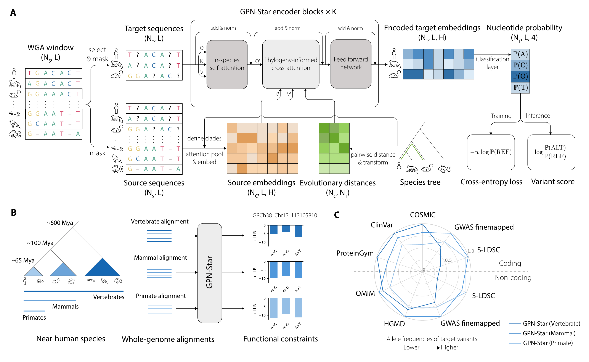

# GPN — Genomic Pretrained Network

[](https://github.com/songlab-cal/gpn/actions/workflows/ci.yml)
[](https://pypi.org/project/gpn/)
[](https://www.python.org/downloads/release/python-3130/)
[](https://github.com/songlab-cal/gpn/blob/main/LICENSE)

[**Quick start**](#quick-start) · [**Model families**](#model-families) ·
[**Demos**](#demos) · [**Documentation**](https://github.com/songlab-cal/gpn/blob/main/docs/index.md)



Code and resources for genomic language models [GPN](https://doi.org/10.1073/pnas.2311219120), [GPN-MSA](https://www.nature.com/articles/s41587-024-02511-w), [PhyloGPN](https://link.springer.com/chapter/10.1007/978-3-031-90252-9_7) and [GPN-Star](https://doi.org/10.1101/2025.09.21.677619).

## Quick start

```bash
pip install gpn
```

Load GPN-Star, our latest model, with standard Transformers AutoClasses:

```python
from gpn import register_auto_classes
from transformers import AutoModelForMaskedLM

register_auto_classes("star")
model = AutoModelForMaskedLM.from_pretrained("songlab/gpn-star-hg38-v100-200m")
```

Explore the [GPN-Star models, alignments, scores, and benchmark datasets](https://github.com/songlab-cal/gpn/blob/main/docs/models/gpn-star.md#published-assets).

## Model families

| Model | Paper | Notes |
| --- | --- | --- |
| [GPN](https://github.com/songlab-cal/gpn/blob/main/docs/models/gpn.md) | [Benegas et al. 2023](https://doi.org/10.1073/pnas.2311219120) | Requires unaligned genomes |
| [GPN-MSA](https://github.com/songlab-cal/gpn/blob/main/docs/models/gpn-msa.md) | [Benegas et al. 2025](https://www.nature.com/articles/s41587-024-02511-w) | Requires aligned genomes for training and inference; deprecated in favor of GPN-Star |
| [PhyloGPN](https://github.com/songlab-cal/gpn/blob/main/docs/models/phylogpn.md) | [Albors et al. 2025](https://link.springer.com/chapter/10.1007/978-3-031-90252-9_7) | Uses an alignment during training, but does not require it for inference or fine-tuning |
| [GPN-Star](https://github.com/songlab-cal/gpn/blob/main/docs/models/gpn-star.md) | [Ye et al. 2025](https://doi.org/10.1101/2025.09.21.677619) | Requires aligned genomes for training and inference |

## Command line

Install file-backed inference dependencies with `pip install "gpn[inference]"` or training dependencies with `pip install "gpn[train]"`.

```text
gpn ss {train,vep,logits,embedding} ...
gpn msa {vep,logits,embedding} ...
gpn star {train,vep,logits,embedding} ...
```

See the [CLI guide](https://github.com/songlab-cal/gpn/blob/main/docs/getting-started/cli.md) for inputs, outputs, and multi-GPU inference.

## Training

GPN and GPN-Star can be trained on prepared data using the maintained [GPN](https://github.com/songlab-cal/gpn/tree/main/recipes/gpn_training) and [GPN-Star](https://github.com/songlab-cal/gpn/tree/main/recipes/gpn_star_training) recipes.

## Demos

- **[Precomputed GPN-Star scores](https://github.com/songlab-cal/gpn/blob/main/colabs/gpn_star_precomputed_scores.ipynb)** · [](https://colab.research.google.com/github/songlab-cal/gpn/blob/main/colabs/gpn_star_precomputed_scores.ipynb)
- **[GPN-Star](https://github.com/songlab-cal/gpn/blob/main/colabs/gpn_star_demo.ipynb)** · [](https://colab.research.google.com/github/songlab-cal/gpn/blob/main/colabs/gpn_star_demo.ipynb)
- **[GPN](https://github.com/songlab-cal/gpn/blob/main/colabs/gpn_demo.ipynb)** · [](https://colab.research.google.com/github/songlab-cal/gpn/blob/main/colabs/gpn_demo.ipynb)
- **[PhyloGPN](https://github.com/songlab-cal/gpn/blob/main/colabs/phylogpn_demo.ipynb)** · [](https://colab.research.google.com/github/songlab-cal/gpn/blob/main/colabs/phylogpn_demo.ipynb)

## Historical analyses

The paper analyses and retired research workflows are preserved in the [`analysis-archive-2026-08-18`](https://github.com/songlab-cal/gpn/tree/analysis-archive-2026-08-18) archive.

## Development and help

See the [documentation](https://github.com/songlab-cal/gpn/blob/main/docs/index.md), ask questions in [Discussions](https://github.com/songlab-cal/gpn/discussions), or report problems in [Issues](https://github.com/songlab-cal/gpn/issues).

GPN is developed in the [Song Lab at UC Berkeley](https://people.eecs.berkeley.edu/~yss/group.html) and distributed under the [MIT License](https://github.com/songlab-cal/gpn/blob/main/LICENSE).

## Citation

[GPN](https://doi.org/10.1073/pnas.2311219120):

```bibtex
@article{benegas2023dna,
  title={DNA language models are powerful predictors of genome-wide variant effects},
  author={Benegas, Gonzalo and Batra, Sanjit Singh and Song, Yun S},
  journal={Proceedings of the National Academy of Sciences},
  volume={120},
  number={44},
  pages={e2311219120},
  year={2023},
  publisher={National Acad Sciences}
}
```

[GPN-MSA](https://www.nature.com/articles/s41587-024-02511-w):

```bibtex
@article{benegas2025dna,
  title={A DNA language model based on multispecies alignment predicts the effects of genome-wide variants},
  author={Benegas, Gonzalo and Albors, Carlos and Aw, Alan J and Ye, Chengzhong and Song, Yun S},
  journal={Nature Biotechnology},
  pages={1--6},
  year={2025},
  publisher={Nature Publishing Group US New York}
}
```

[PhyloGPN](https://link.springer.com/chapter/10.1007/978-3-031-90252-9_7):

```bibtex
@inproceedings{albors2025phylogenetic,
  title={A Phylogenetic Approach to Genomic Language Modeling},
  author={Albors, Carlos and Li, Jianan Canal and Benegas, Gonzalo and Ye, Chengzhong and Song, Yun S},
  booktitle={International Conference on Research in Computational Molecular Biology},
  pages={99--117},
  year={2025},
  organization={Springer}
}
```

[GPN-Star](https://doi.org/10.1101/2025.09.21.677619):

```bibtex
@article{ye2025predicting,
  title={Predicting functional constraints across evolutionary timescales with phylogeny-informed genomic language models},
  author={Ye, Chengzhong and Benegas, Gonzalo and Albors, Carlos and Li, Jianan Canal and Prillo, Sebastian and Fields, Peter D and Clarke, Brian and Song, Yun S},
  journal={bioRxiv},
  pages={2025--09},
  year={2025},
  publisher={Cold Spring Harbor Laboratory}
}
```

[Sorghum gene expression prediction](https://www.nature.com/articles/s41587-026-03046-y):

```bibtex
@article{groover2026mapping,
  title={Mapping cis-regulatory mutations at scale in sorghum enables modulation of gene expression},
  author={Groover, Evan D and Ding, David and Wang, Flora Z and Benegas, Gonzalo and Rivera, Joseph and Schwartz, Shahar and Chen, Stephen and Moubarak, Michael F and Georgieva, Viktoriya and Lemaux, Peggy G and others},
  journal={Nature Biotechnology},
  pages={1--11},
  year={2026},
  publisher={Nature Publishing Group US New York}
}
```
